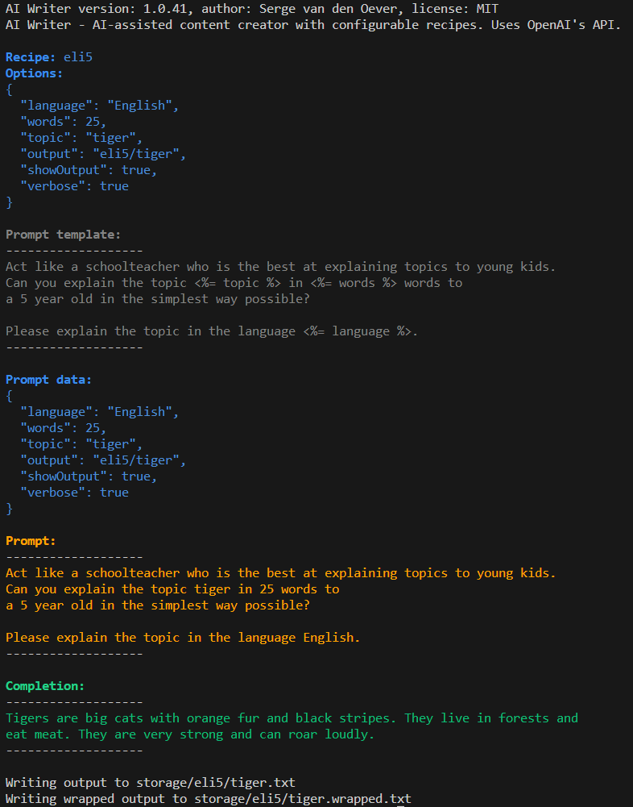

# Get started

If we installed the [prerequisites](./prerequisites), and have [created a project](./create-a-project) we can start using AI Writer.


Using AI Writer is all about creating recipes and executing recipes. The most simple recipe you can think of is the `eli5` recipe. This recipe will explain a topic to you as if you were five years old. Let's try it out:
    
```bash
npx ai-writer eli5 --topic "tiger" --output "eli5/tiger" --show-output --verbose
```

This will result in the following output:



Creating the `eli5` recipe is explained in the [eli5 tutorial](./category/tutorial---eli5-recipe).

## What's next?

- Go through the [eli5 tutorial](./category/tutorial---eli5-recipe) to learn how to create your own simple recipes.
- Have a look at the [recipes](./category/recipes) section to see what ingredients are relevant to a recipe.
- Learn more about the [concepts](./concepts) that are used in AI Writer.
- In the output (as shown above) we use colors to highlight the different parts of the output. You can learn more about the [colors](./concepts/colors) that are used in the output.

