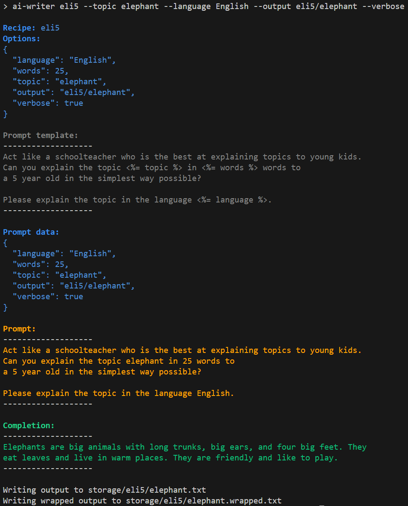

# Executing a recipe

A recipe can either be executed from the command line or a script. Execution of a recipe for the command line in a [terminal window](../advanced/terminal-window) is to execute a single recipe and all the required options must be specified manually. Execution of a recipe from a script can be used to configure (part of) the options in the script. There is however a way more interesting case of using scripts. With a script, it is possible to automate the execution of multiple recipes, and let one recipe use the output of another recipe! With scripts, you can cook yourself a complete meal!

The simplest way is to execute a recipe from the command line. For example, to execute the `eli5` recipe, execute the following command:

```bash
npx ai-writer eli5 --topic elephant --output eli5/elephant
```

The `npx` command is used to execute the `ai-writer` command. The `ai-writer` command is used to execute a recipe. The `eli5` recipe is executed with the `--topic` option to specify the topic of the recipe. The `--output` option is used to specify the output file of the recipe.

## Available recipes in the project

To see all available recipes in your project, execute the following command:

```bash
npx ai-writer
```

## Get help with a recipe

To get help on a recipe, execute the following command:

```bash
npx ai-writer <recipe> --help
```

## The output of a recipe
To specify the output of a recipe, use the mandatory `--output` option. The `--output` option can be used to specify the output file. This file will not contain the extension, and the path is relative to the storage folder. For example, to specify the output of the `eli5` recipe, execute the following command:

```bash
npx ai-writer eli5 --topic elephant --output eli5/elephant
```

The extension will be `.txt` by default but can be overridden using the `--output-format` option. For example, to specify the output of the `eli5` recipe as a Markdown file, execute the following command:

```bash
npx ai-writer eli5 --topic elephant --output eli5/elephant --output-format md
```

In that case the output file will be `eli5/elephant.md`. Supported output formats must be defined in the `output-formats.json` file. See the [output-formats.json](../project/output-formats.json) page for more information.

## See the recipe output in the CLI

To see the output of a recipe in the CLI, use the `--show-output` option. For example, to see the output of the `eli5` recipe in the CLI, execute the following command:

```bash
npx ai-writer eli5 --topic elephant --output eli5/elephant --show-output
```

This will show the wrapped output of the recipe in the CLI, and will also write the output to a file.

## Dry-run a recipe

Execution of a recipe makes a call to the OpenAI API, which costs money and takes time. To prevent this, use the `--dry-run` option. For example, to dry-run the `eli5` recipe, execute the following command:

```bash
npx ai-writer eli5 --topic elephant --output eli5/elephant --show-output --dry-run
```

This option is very useful during the development of the perfect prompt.

Note that the `--dry-run` option automatically enables the `--verbose` option as well for more information.

When the `--dry-run` option is used, the output is:

```text
Dry-run completion on prompt:
<prompt>
```

## Overriding the model configuration

A recipe has a default model configuration as defined in the file `models.json`. This model configuration can be overridden using the `--model-override` option. For example, to override the model configuration of the `eli5` recipe, execute the following command:

```bash
npx ai-writer eli5 --topic elephant --output eli5/elephant --model-override azure-gpt-35
```

The available models are defined in the `models.json` file. See the [models.json](../project/models.json.md) page for more information. This option is very useful for testing out the results of other models (e.g. `gpt-4` versus `gpt-3.5-turbo` versus `text-davinci-003`), but also because Azure OpenAI Service and OpenAI use different model names for the same model.

## Verbose and debug output

To see what is exactly happening during the execution of a recipe, use the `--verbose` option. For example, to see the verbose output of the `eli5` recipe, execute the following command:

```bash
npx ai-writer eli5 --topic elephant --output eli5/elephant --verbose
```

The output will show the following:



Note the used colors, each color has a meaning as described in [Colors](../concepts/colors).

To see even more details, use the `--debug` option. For example, to see the debug output of the `eli5` recipe, execute the following command:

```bash
npx ai-writer eli5 --topic elephant --output eli5/elephant --debug
```

The debug output will show the verbose output and more.

## See also

For more advanced scenaries also have a look into:

- [Executing recipes from script](../advanced/executing-a-recipe-from-script)